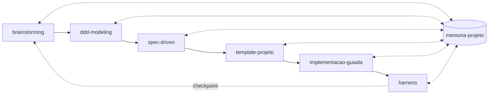

# 🔪 Canivete Suíço — Claude para Dev Solo

**Um plugin de [Skills](https://code.claude.com/docs/en/skills) para o Claude que conduz um projeto de software sozinho, do brainstorming ao deploy — com disciplina de processo em vez de infraestrutura pesada.**

Feito para quem desenvolve sozinho (ou em time pequeno) e quer previsibilidade, segurança e estabilidade sem "usar uma bazuca pra matar uma mosca". Funciona com Claude Code, com o Claude Desktop e com o Cowork.

[](./LICENSE)
[](https://claude.ai)
[](#memória-de-projeto-persistente-e-gratuita)

---

## Sumário

- [O problema que isso resolve](#o-problema-que-isso-resolve)
- [Como funciona](#como-funciona)
- [As 8 skills](#as-8-skills)
- [Instalação](#instalação)
- [Primeiro uso — passo a passo](#primeiro-uso--passo-a-passo)
- [Princípios de design](#princípios-de-design)
- [Memória de projeto (persistente e gratuita)](#memória-de-projeto-persistente-e-gratuita)
- [Estrutura do repositório](#estrutura-do-repositório)
- [Perguntas frequentes](#perguntas-frequentes)
- [Contribuindo](#contribuindo)
- [Licença](#licença)

---

## O problema que isso resolve

Pedir para uma IA "construir um sistema" direto, sem processo, tende a esbarrar sempre nos mesmos quatro problemas:

| Problema | O que costuma acontecer | Como o Canivete Suíço evita |
|---|---|---|
| **Custo de contexto** | A cada nova pergunta, a IA relê o projeto inteiro (ou você reexplica tudo de novo). | A skill `memoria-projeto` grava decisões em arquivos `.md` compactos; cada fase lê só o que precisa. |
| **Escopo crescendo sozinho** | Você pede um CRUD e recebe funcionalidades que nunca pediu. | `spec-driven` define não-objetivos explícitos; `implementacao-guiada` só constrói o que está na spec. |
| **Alucinação de domínio** | Você pede um cadastro de "pessoa" e o código aparece tratando "peça". | `implementacao-guiada` confere todo nome gerado contra o glossário de domínio criado em `ddd-modeling`. |
| **Regressão silenciosa** | Uma feature nova quebra uma que já funcionava, e ninguém percebe até produção. | `harness` roda a suíte de testes **inteira** a cada verificação, não só os testes novos. |

Além disso, o fluxo nunca aplica mais infraestrutura do que o projeto realmente precisa: Kafka, Kubernetes e Terraform só entram em cena quando o **porte** do projeto — diagnosticado, não escolhido no achismo — realmente pede.

## Como funciona



Cada seta sólida é uma fase que entrega um artefato concreto para a próxima. A skill `memoria-projeto` (o cilindro no meio) é o estado compartilhado: toda fase lê dela antes de começar e grava nela ao terminar — é assim que o fluxo evita reler o projeto inteiro a cada pergunta. Depois de cada fase há um **checkpoint**: o Claude mostra o que produziu e pergunta se você quer seguir, ajustar ou parar ali. As fases nunca são encadeadas sem essa pausa.

A skill orquestradora `canivete-suico` decide sozinha por onde entrar: ela lê a pasta `memoria/` do projeto (se existir) e faz **diagnóstico ativo** — perguntas concretas e verificáveis ("já existe uma spec escrita?", "quantos usuários simultâneos são esperados?") — em vez de perguntar algo que só faria sentido para quem já entende o próprio fluxo, como "em que fase eu estou?" ou "isso é um projeto pequeno ou grande?".

## As 8 skills

| # | Skill | Fase | O que faz |
|---|---|---|---|
| 1 | `brainstorming` | Exploração | Gera de 3 a 5 alternativas reais (incluindo "não construir nada"), questiona a ideia inicial, converge numa direção testada. |
| 2 | `ddd-modeling` | Domínio | Modela com DDD — linguagem ubíqua, bounded contexts, entidades, agregados e invariantes — calibrado pelo porte do projeto. |
| 3 | `spec-driven` | Especificação | Transforma o domínio em casos de uso verificáveis: critérios Dado/Quando/Então, contratos, não-objetivos e critérios de UI/UX obrigatórios quando há tela. |
| 4 | `template-projeto` | Estrutura | Aplica ou cria um template de ponta a ponta (estrutura de código + tema visual), reaproveitável entre projetos do mesmo porte. |
| 5 | `implementacao-guiada` | Código | Só implementa o que está na spec, confere nomes contra o glossário de domínio (anti-alucinação) e declara o raio de alteração antes de mexer. |
| 6 | `harness` | Verificação | Confere a implementação contra a spec e a UI/UX, roda a suíte de testes inteira (anti-regressão) e escala a automação conforme o porte. |
| 🧭 | `canivete-suico` | Orquestrador | Encadeia as seis fases acima, diagnosticando memória, fase atual e porte por sinais concretos — com checkpoint entre cada uma. |
| 🧠 | `memoria-projeto` | Memória | Mantém a pasta `memoria/` do projeto: lê no início de cada fase, atualiza (nunca duplica) ao final. |

Cada skill também funciona sozinha — por exemplo, peça só "modela o domínio disso pra mim" e o Claude aciona `ddd-modeling` isoladamente, sem passar pelas outras fases.

## Instalação

Escolha a opção conforme onde você usa o Claude. Todas as três chegam ao mesmo resultado: as 8 skills disponíveis para o Claude usar.

### Opção A — Claude Code (terminal ou aba "Code" do Desktop)

Este repositório já inclui um manifesto de marketplace, então basta:

```shell
/plugin marketplace add weslenascimento/canivete-suico-claude
/plugin install canivete-suico-claude@canivete-suico
```

Se o resultado da instalação disser `Run /reload-plugins to activate.`, rode:

```shell
/reload-plugins
```

### Opção B — Cowork ou aba "Cowork" do Claude Desktop

No painel **Customize** (barra lateral), adicione este plugin apontando para este repositório (`weslenascimento/canivete-suico-claude`) na seção de plugins. Se sua versão do Cowork ainda não expõe adicionar um plugin por URL/repositório diretamente, use a Opção C abaixo — ela funciona em qualquer superfície do Claude, sem exceção.

### Opção C — Manual (funciona em qualquer lugar, inclusive sem suporte a plugins)

1. Baixe ou clone este repositório.
2. Copie o conteúdo de `skills/` para a pasta de skills que sua conta/instalação do Claude usa (por exemplo `~/.claude/skills/` em uma instalação local), **ou** cole o conteúdo de cada `SKILL.md` na conversa e peça ao Claude para salvá-lo como uma skill pessoal.
3. Pronto — as 8 skills passam a estar disponíveis.

> Instalado como plugin (Opções A/B), as skills são acionadas como `/canivete-suico-claude:canivete-suico`, `/canivete-suico-claude:ddd-modeling` etc. Copiadas manualmente (Opção C), são acionadas pelo próprio nome, ex: `/canivete-suico`, `/ddd-modeling`. Em ambos os casos, você também pode simplesmente **descrever a tarefa em português** ("quero começar um projeto novo do zero") — o Claude reconhece a skill certa pela descrição e a aciona sozinho, sem precisar do comando explícito.

## Primeiro uso — passo a passo

Um exemplo de como a primeira conversa costuma ir, para quem nunca usou:

```
Você: Quero começar um sistema de pedidos para uma padaria pequena, ainda não
tenho nada escrito sobre isso.

Claude (canivete-suico):
  → Não encontrei pasta memoria/ neste projeto — vamos começar do zero.
  → [diagnostica a fase: nada existe ainda → começa em brainstorming]
  → "Qual problema isso resolve hoje? O que a padaria faz agora sem esse
     sistema — anota pedido no papel, no WhatsApp?"

Você: Hoje é tudo no caderno mesmo, perde pedido direto.

Claude:
  → Gera 3 alternativas (planilha compartilhada, app pronto de pedidos,
    sistema próprio simples) e questiona: "um app pronto resolveria por um
    preço menor — tem algum motivo pra não usar um?"
  → Converge com você numa direção, fecha o Brief de Decisão, grava em
    memoria/brief.md.
  → "Quer seguir para modelar o domínio (ddd-modeling)?"

Você: Sim.

Claude (ddd-modeling):
  → "Quais são as principais 'coisas' que esse sistema mexe — pedido,
     cliente, item do cardápio? E quais ações acontecem sobre elas —
     criar pedido, cancelar, marcar como entregue?"
  → [constrói a linguagem ubíqua com base nas respostas, sem perguntar
     nada que exija você já saber o que é 'bounded context']
  → ...e assim por diante até harness, sempre com checkpoint entre fases.
```

Repare que em nenhum momento o Claude pergunta algo como "qual é o porte do seu projeto?" ou "em que fase você está?" — isso é responsabilidade das skills descobrirem sozinhas, por diagnóstico ativo.

## Princípios de design

- **Diagnóstico ativo, nunca autoavaliação do usuário.** Nenhuma skill pergunta algo que exige que você já entenda o próprio fluxo para responder. Elas descobrem isso sozinhas — pela memória do projeto, ou por perguntas concretas e verificáveis (ex: "quantos usuários simultâneos são esperados?" em vez de "isso é um projeto grande?").
- **Porte como diagnóstico, não escolha.** O porte (pequeno/médio/grande) é definido por sinais concretos — número de usuários, necessidade de mais de um serviço, fila/Kafka/Kubernetes/Terraform realmente necessários — e registrado em `memoria/porte.md`. Ele calibra tudo adiante:

  | Porte | Bounded contexts | Contratos | Harness / infra |
  |---|---|---|---|
  | Pequeno | Um único, por padrão | Mínimos, sem documentação formal | Checklist manual, zero infra externa |
  | Médio | Poucos, com fronteiras formais | Explícitos e versionados | CI real + infra gerenciada simples, se o caso pedir |
  | Grande | Múltiplos, se refletirem times/serviços reais | Tratados como contratos publicados entre serviços | Pipeline de CI completo + IaC (Terraform) + Kubernetes + observabilidade |

  O porte nunca é escolhido por ambição ("fica mais profissional") — só pelos sinais acima. E pode ser rediagnosticado se o projeto mudar de escala no meio do caminho.
- **Guardas específicas contra os erros mais comuns de código gerado por IA:** não-objetivos explícitos na spec (contra escopo crescendo sozinho), checagem de nomes contra o glossário de domínio (contra alucinação) e suíte de testes inteira a cada verificação (contra regressão).
- **Memória persistente, sem custo de token nem custo financeiro.** Ver seção abaixo.

## Memória de projeto (persistente e gratuita)

Cada fase grava um resumo compacto em `memoria/`, na raiz do seu projeto, em vez de exigir que o Claude releia tudo (ou que você reexplique) a cada nova pergunta:

```
memoria/
├── index.md            # ponto de entrada, linka as notas abaixo
├── brief.md             ← brainstorming
├── dominio.md            ← ddd-modeling
├── porte.md              ← classificação de porte + sinais que levaram a ela
├── spec.md               ← spec-driven
├── template.md           ← template-projeto
├── implementacao.md      ← implementacao-guiada
└── harness.md            ← harness
```

São arquivos `.md` puro com `[[wikilinks]]` — nenhuma ferramenta paga é necessária. Você pode simplesmente ler e editar esses arquivos em qualquer editor de texto. Se quiser navegar pelos links clicáveis, qualquer uma destas opções gratuitas funciona sem configuração extra:

- **[Foam](https://foambubble.github.io/foam/)** (recomendado) — extensão grátis e open source do VS Code.
- **[Logseq](https://logseq.com/)** — grátis, open source.
- **[Obsidian](https://obsidian.md/)** — grátis para uso pessoal.

Nenhuma dessas ferramentas precisa estar instalada para o fluxo funcionar — elas só tornam os `[[wikilinks]]` clicáveis.

## Estrutura do repositório

```
canivete-suico-claude/
├── .claude-plugin/
│   ├── plugin.json         # manifesto do plugin
│   └── marketplace.json    # permite instalar via /plugin marketplace add
├── skills/
│   ├── brainstorming/SKILL.md
│   ├── ddd-modeling/SKILL.md
│   ├── spec-driven/SKILL.md
│   ├── template-projeto/SKILL.md
│   ├── implementacao-guiada/SKILL.md
│   ├── harness/SKILL.md
│   ├── memoria-projeto/SKILL.md
│   └── canivete-suico/SKILL.md
├── LICENSE
└── README.md
```

## Perguntas frequentes

**Preciso instalar o Obsidian ou o Foam para usar isso?**
Não. São só sugestões gratuitas para navegar pela pasta `memoria/` com mais conforto. Os arquivos são `.md` puro e funcionam em qualquer editor.

**Funciona para qualquer linguagem/stack?**
Sim. Nenhuma skill assume uma linguagem ou framework específico — `template-projeto` pergunta sua stack de forma concreta na primeira vez e reaproveita a resposta depois.

**Preciso usar as 6 fases sempre, do início ao fim?**
Não. Cada skill funciona isolada. Use `canivete-suico` quando quiser o fluxo completo ou não souber por onde começar; use uma skill específica (ex: `spec-driven`) quando só precisar daquela fase.

**Isso serve para times, ou só para quem desenvolve sozinho?**
Foi desenhado pensando em quem desenvolve sozinho (daí o nome), mas nada aqui impede o uso em times pequenos — o diagnóstico de porte inclusive já prevê múltiplos serviços/times quando os sinais indicam isso.

**Tem algum custo para usar?**
As skills em si não têm custo além do uso do Claude. Todas as ferramentas sugeridas (Foam, Logseq, Obsidian) são gratuitas — esse é um requisito de design do projeto, não um detalhe incidental.

## Contribuindo

Sugestões, correções e novas skills que sigam os mesmos princípios (diagnóstico ativo, calibração por porte, zero custo financeiro) são bem-vindas. Abra uma [issue](https://github.com/weslenascimento/canivete-suico-claude/issues) descrevendo o problema ou a melhoria antes de mandar um pull request, para alinhar a abordagem primeiro.

## Licença

[MIT](./LICENSE) — use, adapte e redistribua livremente.
